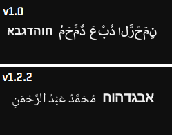
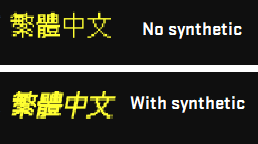

# 🚀 What's New in v1.2.2

## Bug Fixes

**1. Bidi Rendering & HarfBuzz Shaping**
Fixed incorrect rendering order for Arabic, Hebrew, and other RTL scripts. Characters now display and shape correctly within mixed-direction text.



---

## New Features

**2. Inline Styling — Multiple Faces per Surface**

Apply bold, italic, or any registered font face to specific segments of text using inline tags, without creating separate render calls.

```python
# Tag syntax — wrap any segment
font_engine.render("</bold={Bold text}> and regular", size=20, color=(255,255,255))
font_engine.render("<italic={Italic text}>", size=14, color=(100,180,180))
font_engine.render("<bold italic={Bold italic}> back to normal", size=14, color=(100,180,180))

# Or apply a face to the entire surface
font_engine.render("All bold here", size=20, color=(255,255,255), face="bold")
```


---

**3. Synthetic Bold & Italic Fallback**

When a font family does not include a dedicated bold or italic file, the engine now automatically synthesizes the style using FreeType's C-API (`FT_GlyphSlot_Embolden`, `FT_GlyphSlot_Oblique`) instead of silently falling back to the regular face.

This applies to both the primary and fallback fonts, and is skipped automatically when a real font file is found — so there is no change in behavior for fonts that already have proper faces.



---

## Internal Improvements

- `get_engine_version()` — new method to query the current engine version at runtime
- `get_debug_info(text)` — upgraded debugger with per-character metadata: Unicode codepoint, category, script group, font source (PRIMARY / FALLBACK / EMOJI / INTL), TTC index, synthetic flag, render path, and inline tag context
- Protected internal variables (`_ft_lib`, `_SYNTHETIC_FACE_MAP`, etc.) from external overwrite via the existing `_ProtectedEngine` mechanism