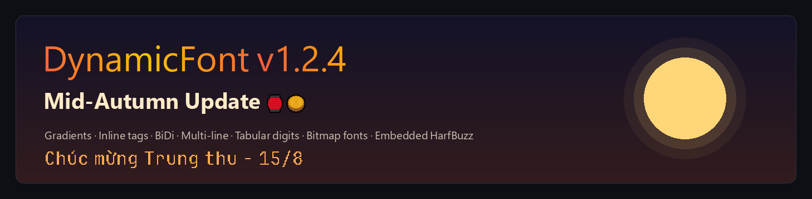
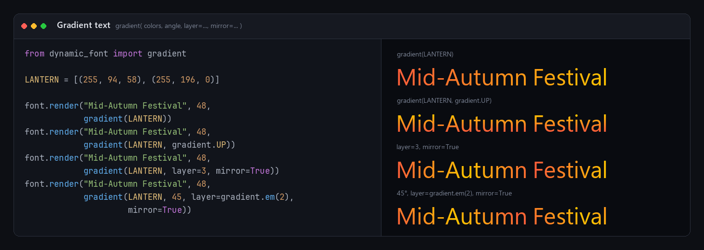
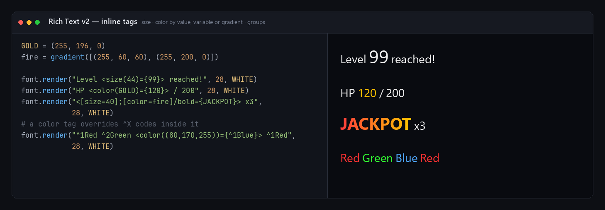
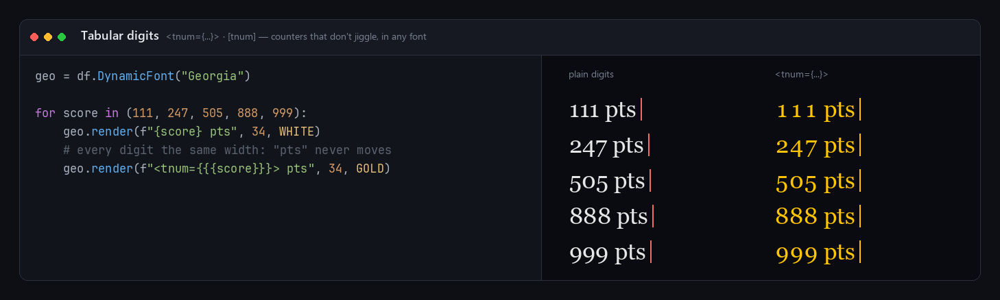
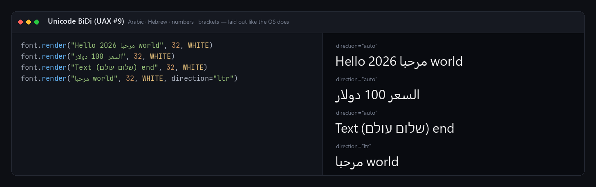
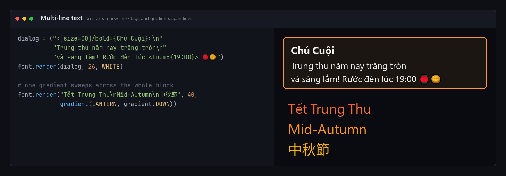
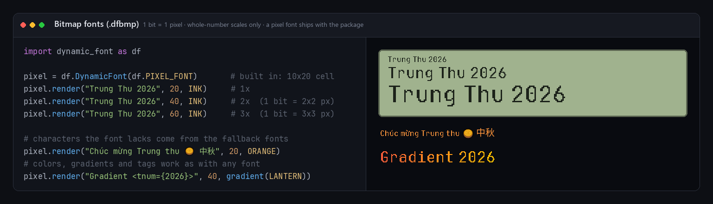
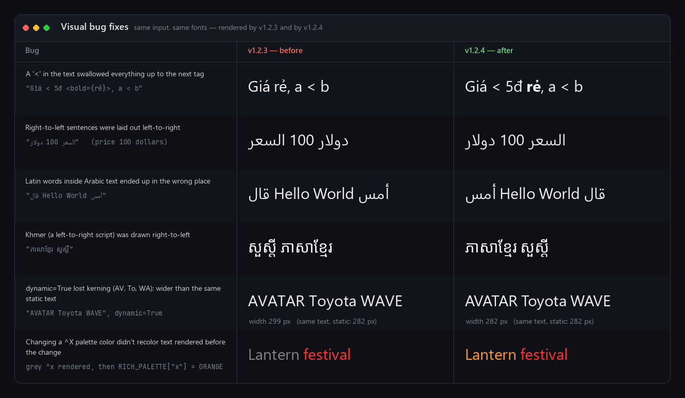

# 🏮 What's New in v1.2.4 — Mid-Autumn Update



A big release: gradient text, a second generation of inline tags, correct
right-to-left text, multi-line text, tabular digits and pixel-perfect bitmap
fonts — plus a rendering pipeline that is much faster for text that changes
every frame. HarfBuzz and a Unicode BiDi engine are now compiled into the
extension, so **pygame / pygame-ce is still the only thing you need to
install**.

Every image below is real output: the code on the left is what produced the
text on the right. The scripts that made the images and measured the numbers
are in [`docs/v1.2.4/`](docs/v1.2.4/README.md) — run them to check.

---

## ✨ New Features

**1. Gradient text**

Any `render()` color can be a gradient. One import, readable directions, and a
`layer` option that repeats the sweep — stretched over the text, every N
pixels, or every N × font size (so a dynamic counter keeps its colors while
the number changes).

```python
from dynamic_font import gradient

gradient([RED, GOLD])                          # left -> right
gradient([RED, GOLD], gradient.UP)             # RIGHT / UP / LEFT / DOWN, or any angle in degrees
gradient([RED, GOLD], layer=3, mirror=True)    # 3 sweeps, every other one reversed
gradient([RED, GOLD], layer=gradient.px(60))   # one sweep every 60 px
gradient([RED, GOLD], layer=gradient.em(2))    # one sweep every 2 x the font size
```

The gradient is applied per pixel while the glyphs are drawn and sweeps
across the whole line (or the whole block, for multi-line text). Color
emoji keep their own colors.



**2. Rich Text v2 — size and color tags**

Inline tags can now change the size and the color of part of the text, and
several options can be combined in one tag. Colors can be a tuple, a
`pygame.Color`, a gradient, or simply **the name of a variable** — it is
looked up where `render()` is called.

```python
font.render("Level <size(40)={99}> reached!", 24)
font.render("HP <color(ORANGE)={120}> / 200", 24)               # ORANGE = (255, 136, 0)
font.render("<[aa];[size=40];[color=fire]/bold={JACKPOT}>", 24)  # fire = gradient([...])
```

- Text of different sizes on one line shares one baseline.
- A color tag overrides `^X` palette colors inside it; a gradient in a tag
  covers just the tagged text.



**3. Tabular digits — `tnum`**

Scores, timers and HP values no longer make the text around them shift
when the number changes: every digit 0–9 gets the same width.

```python
font.render("Score: <tnum={001190}>", 24)
font.render("<[tnum];[size=40]/bold={12:05}>", 24)
```

It uses the font's own tabular digits when it has them, and gives equal
widths in fonts that don't (such as Georgia) or that kern digit pairs (such
as Arial's "11").



**4. Unicode BiDi (UAX #9) — `direction=`**

Arabic, Hebrew and every other right-to-left script are laid out with the
standard Unicode Bidirectional Algorithm (via the embedded
[SheenBidi](https://github.com/Tehreer/SheenBidi)): word order, numbers,
punctuation and brackets come out the way the operating system shows them,
and each run is shaped with its real script. `render(..., direction="auto" |
"ltr" | "rtl")` sets or forces the paragraph direction.



**5. Multi-line text**

A `\n` (or `\r\n`) in the text starts a new line. Lines are left-aligned and
one font line height apart, all in one Surface; tags and `^X` colors can span
lines, and a `render()` gradient sweeps across the whole block.



**6. Bitmap fonts — `.dfbmp`**

A `.dfbmp` file is a pixel font in one small file: the glyphs themselves,
stored as bits, plus the few numbers that describe them (cell size, baseline,
gap). Unlike an image atlas, there is no separate definition file — it loads
like any other font:

```python
pixel = dynamic_font.DynamicFont(dynamic_font.PIXEL_FONT)   # the pixel font that ships with the package
pixel.render("Score: 12345", 40, WHITE)                    # 2x: one bit = 2x2 pixels
```

- One bit is one screen pixel; `size` picks the nearest **whole-number**
  scale (1x, 2x, 3x…), so pixels always stay square and sharp.
- Colors, gradients, tags, multi-line text and `tnum` work as with any
  font. Characters the bitmap font doesn't have come from the fallback
  fonts, as tall as the bitmap line (`dynamic_font.SYNC_FONT_SIZE`).
- **DynamicFont Pixel** ships with the package (`dynamic_font.PIXEL_FONT`): a
  10×20-pixel font with ASCII and full Vietnamese, made from JetBrains Mono
  (SIL Open Font License) by [`scripts/make_pixel_font.py`](scripts/make_pixel_font.py) —
  try bitmap fonts right after `pip install`.
- A builder and a viewer come with the package — HTML pages that open in
  your browser and work offline:

```
python -m dynamic_font -buildbitmap     # make a .dfbmp from an atlas image
python -m dynamic_font -bitmapviewer    # see every glyph of a .dfbmp file
```



**7. Other additions**

- `render(..., use_primary_space=True)`: spaces take the primary font's own
  width instead of the fallback font's — keeps monospace fonts (e.g.
  JetBrains Mono) column-aligned.
- `get_debug_info()` now reports each character's real Unicode script
  (`"Latin"`, `"Arabic"`, `"Han"`…), its ISO 15924 tag, BiDi level and
  direction, and the path it takes (`SHAPED`, `BITMAP`, `EMOJI`, `NEWLINE`,
  `IGNORED`). It takes `direction=` too, and is 2.4–6.8× faster.
- `get_harfbuzz_version()` returns the version of the embedded HarfBuzz.
- `dynamic_font.RICH_PALETTE` — the `^X` color palette — is available from the
  package: add or change colors (`RICH_PALETTE["x"] = (255, 150, 40)`) or
  replace the whole palette.

---

## 🐞 Bug Fixes

The six fixes below change what gets drawn — here is the same input rendered
by v1.2.3 and by v1.2.4:



- **A `<` in the text swallowed everything up to the next tag.** `"Giá < 5đ
  <bold={rẻ}>"` lost `"< 5đ"` and the bold; a `<` that isn't a tag is now
  shown as text.
- **Right-to-left text in the wrong order.** Of 8 measured cases (Arabic with
  numbers, Hebrew in brackets, Latin inside Arabic…) v1.2.3 got 3 right;
  v1.2.4 gets all 8.
- **Khmer was treated as a right-to-left script** and drawn backwards.
- **`dynamic=True` lost kerning** (AV, To, WA) and rounding error built up
  along the line, so dynamic and static renders of the same text differed.
  Dynamic text is now shaped exactly like static text.
- **Changing a `^X` palette color didn't recolor text already rendered** —
  static text kept the colors it was first drawn with. Editing or replacing
  `RICH_PALETTE` now takes effect on the next `render()`.
- Text with many script / color changes (a run per word) could silently drop
  runs past an internal limit.
- A missing fallback font crashed `render()`; it now falls back cleanly.
- Every `DynamicFont` instance kept its own copy of each font face open
  (+335 MB over 60 instances); faces are now shared by the whole process.
- Color tags understand pygame-ce's `str(pygame.Color)` format
  (`Color(r, g, b, a)`), so an f-string with a `pygame.Color` works.
- COLRv1 emoji: palette indices out of range and deeply nested paint graphs
  are handled safely.
- Color emoji rendering no longer needs a display (headless servers, tests).
- Font paths with non-ASCII characters work on Windows.

---

## ⚡ Performance

Median time per `render()` call, same machine, same fonts (Python 3.14,
[`docs/v1.2.4/benchmark.py`](docs/v1.2.4/benchmark.py)):

| Scenario | v1.2.3 | v1.2.4 |
| ----- | ----- | ----- |
| Static text (cache hit) | 0.0007 ms | 0.0007 ms |
| `dynamic=True`, ASCII counter | 0.044 ms | 0.036 ms |
| `dynamic=True`, mixed scripts + emoji | 1.11 ms | 0.058 ms (**~19×**) |
| `dynamic=True`, Arabic + number | 0.79 ms | 0.049 ms (**~16×**) |

- Rasterized glyphs are cached once for every color (`MAX_GLYPH_CACHE` now
  sizes this glyph cache), and HarfBuzz results, per-run layouts and parsed
  tag runs are cached as well.
- All runs of a line are drawn straight into one Surface instead of one
  Surface per run blended together.
- Font faces are shared across instances: 8 live `DynamicFont` instances use
  +7 MB instead of +47 MB.
- The static-text cache hit stays the first thing `render()` does, so
  already-rendered text costs the same as before.

---

## 🛠 Internal / Build

- **HarfBuzz 14.5.0 and SheenBidi 3.0.0 are compiled into the extension.**
  The `uharfbuzz` dependency is gone; wheels need nothing but pygame or
  pygame-ce.
- CI builds HarfBuzz and SheenBidi once per architecture as static libraries
  (`hbsb/CMakeLists.txt`, like FreeType) instead of recompiling them for every
  wheel.
- Windows wheels no longer depend on `VCRUNTIME140_1.dll`.
- The full license texts of FreeType, libpng, zlib, HarfBuzz, SheenBidi, the
  bundled Noto fonts and DynamicFont Pixel ship inside every wheel
  (`dynamic_font/licenses/`).
- Tag parsing, BiDi and script itemization all run in C (`c_parser.c`);
  gradients have their own C module (`c_gradientcolor.c`), bitmap fonts theirs
  (`c_bitmapfont.c`).
