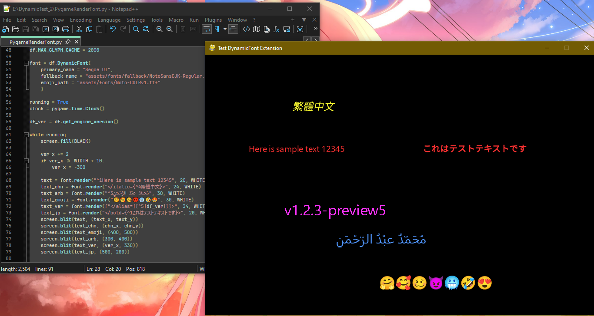
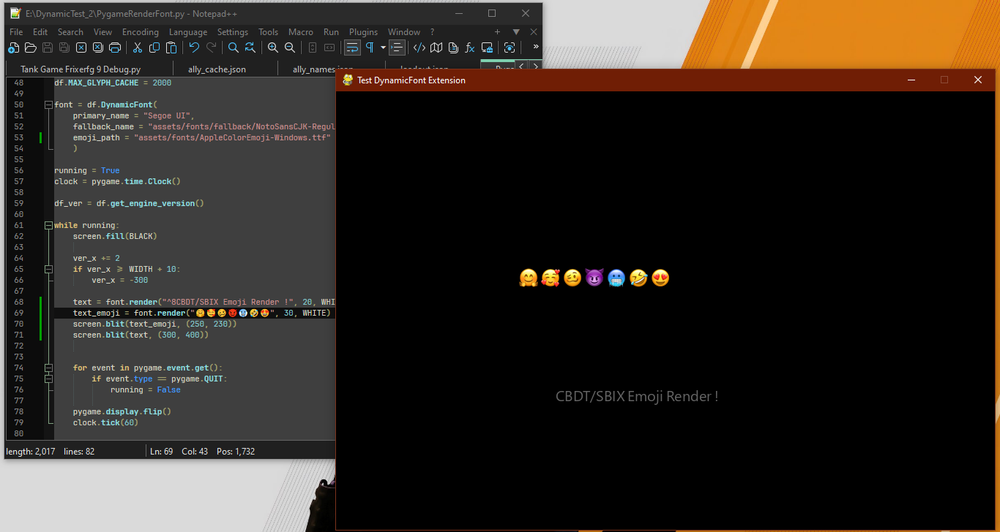
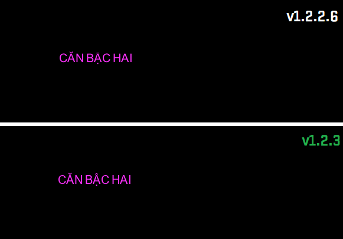

# 🚀 What's New in v1.2.3.1 ?

Small patch focused on making the zero-config defaults actually
work everywhere, plus a cleaner package.

- **`fallback_name` default changed from "Times New Roman" to the
  bundled `NotoSansCJK-Regular.ttc`.** "Times New Roman" is a
  Windows-bundled font with no guaranteed presence on Linux or
  macOS — the previous default silently didn't work as intended on
  those platforms. Pointing at the package's own bundled Noto Sans
  CJK instead means the default now genuinely works identically on
  every OS out of the box, consistent with this project's own
  "Zero-Configuration Fonts" goal from v1.2.3 rather than working
  against it on two of the three supported platforms.
- **Wheels no longer bundle the `.c`/`.h`/`.pyx` source files.**
  Confirmed via a real build that these were being shipped into
  every installed wheel (not just the sdist) due to setuptools'
  `include_package_data=True` including everything inside the
  package directory by default. The sdist (source distribution)
  is unaffected and still contains the full source, since that's
  what a from-source build actually needs — only the wheel (which
  only needs the compiled binary to run) is now trimmed.

---

# 🚀 What's New in v1.2.3 ?

This is a major engine update focused on color emoji quality, startup performance, and reducing external dependencies. Every change below was verified against real fonts and real rendered output before shipping — see the "Verification" notes where relevant.

---

## 🎨 New Features

**1. COLRv1 Emoji Rendering (new C renderer, `colrv1_render.c`)**

Full vector color-glyph support — solid fills, linear/radial/sweep gradients, transforms (translate/scale), and the two most common composite modes (`SRC_OVER`, `DEST_OVER`, `SRC_IN`). Verified at 99.1% glyph coverage (3958/3993 color glyphs) against a real production COLRv1 font, with byte-level pixel checks confirming correct alpha compositing and un-premultiplication.
```python
# ...
font = dynamic_font.DynamicFont(
	primary_name = "Arial",
	fallback_name = "Calibri",
	emoji_path = "NotoColorEmoji-Regular.ttf" #COLRv1 Emoji"
	)
# ...
text_emoji = font.render("😊😉🤡🥰", size=20, color=(255,255,255))
text_emoji_italic = font.render("</italic={😁😀🤑🎉}>", size=20, color=(255,255,255))
screen.blit(text_emoji, (100,200))
screen.blit(text_emoji_italic, (200, 300))

```



**2. CBDT Emoji Rendering (new C renderer, `cbdt_render.c`)**

Support for the older, bitmap-based color emoji format (embedded PNG per glyph) — the format Apple Color Emoji and older Noto builds use. Requires FreeType built with PNG support (`FT_REQUIRE_PNG`, linked against `libpng`/`zlib` — see `build_all.bat`). Automatically selects the closest embedded bitmap "strike" size for the requested font size, and skips unnecessary rescaling below a mismatch threshold to avoid `smoothscale` blur on well-populated multi-strike fonts (confirmed via direct sharpness measurement: unnecessary scaling was cutting edge contrast by ~97% even for a ~6% size mismatch).
```python
# ...
font = dynamic_font.DynamicFont(
	primary_name = "Arial",
	fallback_name = "Calibri",
	emoji_path = "AppleColorEmoji.ttf" #CBDT/SBIX Emoji"
	)
```



**3. Unified Emoji Rendering Pipeline**

Every emoji — single codepoint, ZWJ sequence (families, professions), or skin-tone variant — now goes through ONE HarfBuzz-shaped code path with a single fallback chain: **COLRv1 → COLRv0 → CBDT → pygame.font**. Positioning uses the real device-pixel top/left offsets reported by each C renderer (not an approximation), fixing multi-piece composite ligatures (e.g. Segoe UI Emoji's family glyphs) that previously rendered with misaligned sub-parts.


**4. Font Hinting Re-enabled**

Fixed thin diacritic marks (Vietnamese circumflex + tone-mark stacks, e.g. "Ậ") rendering as faint/clipped at moderate-to-large sizes. The engine previously disabled FreeType hinting entirely; re-enabling it restores proper grid-fitting for thin strokes, matching what native OS text renderers (e.g. Windows' ClearType) already do. Synthetic bold/italic glyphs still skip hinting (unchanged), since it can conflict with the outline transform.


**5. Zero-Configuration Fonts — Bundled Noto Family + OS Emoji Auto-Detection**

`fallback_dir` and `emoji_path` are now optional. When omitted, `fallback_dir` points at Noto Sans plus per-script variants (CJK, Arabic, Devanagari, Thai, and dozens more) bundled directly in the package — licensed under the SIL Open Font License, which explicitly permits redistribution — and `emoji_path` auto-detects the OS's own installed emoji font (Segoe UI Emoji on Windows, Apple Color Emoji on macOS, Noto Color Emoji on most Linux distros) rather than bundling one, since not every emoji font is freely redistributable. Falls back to a bundled Noto Color Emoji copy if no system emoji font is found at all. Both remain fully overridable by passing explicit paths. Verified end-to-end on real Windows hardware: auto-detection correctly resolved `C:\Windows\Fonts\seguiemj.ttf`, and rendered real CJK text (Traditional Chinese + Japanese) through the bundled fallback with zero configuration; the resulting wheel's contents were inspected directly and confirmed to contain all 111 bundled font files. Apple Color Emoji specifically (`sbix` table format, not CBDT) is expected to work through the existing CBDT renderer based on FreeType's documented handling of both formats through the same code path, though this specific combination hasn't been verified on real macOS hardware yet.

---
## ⚡ Performance

**6. fontTools Dependency Removed Entirely**

Font name-table reading (`build_font_map()`) and per-glyph existence checks (`_has_glyph()`) now go straight through the already-embedded FreeType C API (`FT_Get_Sfnt_Name`, `FT_Get_Char_Index`) instead of the pure-Python `fontTools` library. Verified byte-for-byte identical output against `fontTools` on real fonts (including multi-face `.ttc` collections) before replacing it. `_has_glyph()` in particular now caches a single `FT_Face` per font instead of parsing and holding the font's entire cmap table in a Python dict.

**7. Font-Suffix Matching Optimized**

The 38-entry sequential suffix-stripping loop (`" bold italic"`, `"-lightitalic"`, etc.) used during font family-name parsing is now a single precompiled regex — verified behavior-identical against the original loop across 33 test cases, including edge cases (empty strings, mid-string matches, near-miss suffixes like `"boldbold"`).

**8. Font Scanning + Inline-Tag Parser Rewritten in Pure C (`c_fontscanner.c`, `c_parser.c`)**

System font directory scanning and the inline-tag/script/bidi parser previously ran at the Cython/Python level; both are now pure C, called directly from the render path with no Python-object overhead. Measured end-to-end on the same benchmark rig used throughout this project's development: average render time dropped from 0.031ms to 0.023ms — a ~26% improvement on top of an already-fast baseline, confirmed by repeated runs rather than a single sample.

---

## 🛠 Internal / Build

- FreeType is now built from source with PNG support (`zlib` → `libpng` → `FreeType`, see `build_all.bat`) — required for CBDT and previously disabled.
- New precise glyph positioning API: `render_colrv0_glyph()` / `render_colrv1_glyph()` / `render_cbdt_glyph()` all report the real device-pixel `top`/`left` offset of their output bitmap, instead of callers approximating position from bitmap height alone.
- `EMOJI_OFFSET_Y`'s effective meaning is preserved across all of the above internal formula changes via hidden calibration constants — the value `0.15` still produces the same visual result it always has, with no user-facing adjustment needed.
- GitHub Actions workflow added (`build_wheels.yml`) — builds wheels for Windows, Linux, and macOS across CPython 3.8–3.14 via `cibuildwheel`.
- Memory-safety hardening found during code review, unrelated to any specific feature above: a missing `try/finally` around the ASCII fast-render path's heap buffer (leaked on exception mid-render, now fixed to match the same pattern already used elsewhere in the file); a symlink-loop protection gap on POSIX systems during font directory scanning (`stat()` swapped for `lstat()`, matching the loop-guard Windows already had via its own reparse-point check); leftover Vietnamese-language comments in newly-added C source translated to English for consistency with the rest of the codebase.
- Restructured from a single flat `.pyx` module into a proper `dynamic_font/` package (`dynamic_font/__init__.py` + `dynamic_font/_core.pyx`), required to bundle the Noto font files as installable package data. `import dynamic_font` and all existing usage are unaffected — including the module-level config variables (`MODERN_FONT`, `SMOOTH_FONT`, `ANTI_ALIAS`, `EMOJI_OFFSET_Y`), which forward through to the compiled extension via property proxying rather than becoming disconnected copies, verified by confirming a value set through the public `dynamic_font` namespace is visible from the compiled `_core` module directly.

---