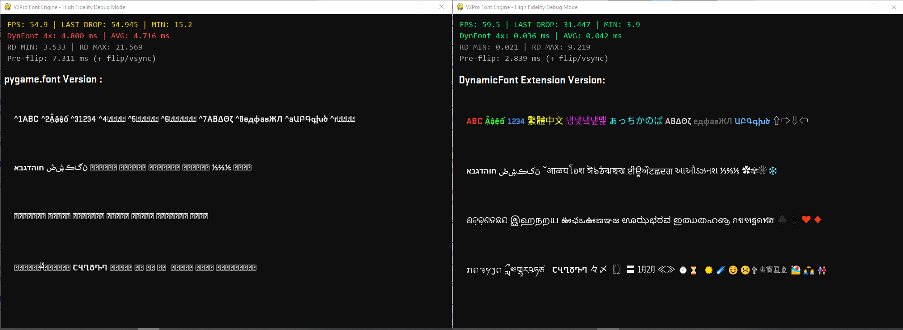

# 🚀 DynamicFont: Font Render Extension for Pygame

**DynamicFont** is a professional-grade Cython extension designed to eliminate the long-standing text rendering bottlenecks in standard Pygame and Pygame-CE. By engineering a custom **Texture Atlas (Glyph Caching)** architecture, it achieves rock-solid 60 FPS rendering for highly dynamic content—such as data dashboards, real-time timers, and FPS counters—without the CPU spikes or memory leaks typical of traditional surface generation.

## 💎 The Architecture: Why is it faster?

Standard rendering methods in Pygame calculate typography and allocate new RAM for every single text update. DynamicFont fundamentally changes this paradigm:

* **⚡ Texture Atlas Generation**: Every unique character is rasterized exactly *once* and stored as a reusable bitmap in a high-speed dictionary (`_glyph_cache`).
* **🛡️ Zero-Allocation Dynamic Path**: For rapidly changing text, the engine bypasses FreeType entirely. It simply "blits" pre-rendered glyphs onto the target surface, achieving `O(1)` complexity per character and generating zero garbage for the Python GC.
* **🧹 O(1) Drip Eviction**: Employs a trickle-down cache management system to prevent the infamous "Micro-stutters" caused by mass memory deallocation during gameplay.
* **⚖️ Perfect Baseline Alignment**: The `SMOOTH_FONT` engine ensures that mixed content—including Emojis and diverse font faces—remains perfectly aligned on a consistent typographic baseline.

## ✨ Key Features

* **Blazing Fast**: Written in pure Cython for C-level execution efficiency.
* **TrueType Collections (.ttc)**: Full native support for indexing and extracting specific faces from `.ttc` files.
* **Smart Font Fallback**: Automatically searches system paths and local directories to support international characters (Thai, Arabic, Hindi, etc.) without crashing.
* **HarfBuzz Integration**: Complex script shaping ensures ligatures and connected scripts are rendered flawlessly.
* **Rich Text Palette**: Built-in multi-color string support using a simple `^` prefix (e.g., `^1Red Text ^2Green Text`).
* **COLRv0 Emoji Support**: Accurately renders colored emojis alongside standard text using dual-engine fallback routing.




## Folder Structure
```plaintext
Pygame DynamicFont Extension/
├── assets/fonts                      # Assets bundle 
├── .github/workflow
├── docs
├── dynamic_font.pyx  # Source code
├── .gitignore
└── README.md
```

## 🛠 Prerequisites & Installation

Ensure you have the following dependencies installed before compiling the `.pyx` file:

```bash
pip install pygame-ce cython fonttools uharfbuzz emoji
```
* **Python 3.8 or later (64-bit)  ( Windows can use 32-64 )
* **Pygame or Pygame-CE** (Recommended): The high-performance core graphics engine.
* **Cython**: Required to compile the extension.
* **fontTools**: For font cmap indexing and fallback detection.
* **uharfbuzz**: For advanced text shaping and internationalization.
*  **emoji**: For emoji mapcode 

## 🚀 Quick Start

### 1. Engine Initialization

1. Download the wheel package that matches your current Python version. and copy assets bundle to your project
2. In Main .py, insert this:

```python
import dynamic_font

# Initialize with global fallback layers for international support
font = dynamic_font.DynamicFont(
    primary_name="Arial", # or TTF/OTF Directory !
    fallback_name="Segoe UI",
    fallback_dir="assets/fonts/fallback",
	emoji_path ="assets/fonts/SegoeUIEmoji-Regular.ttf" # You can add COLRv0 or monochrome Emoji Font file !
)
```

### 2. Rendering Logic

The engine optimizes its execution path automatically based on the `dynamic` flag:

* **Static UI Elements** (Labels, Menus, Dialogues): Uses string-level caching for maximum efficiency.
* **Dynamic Data Displays** (Scores, Sensors, Timers): Uses the **Zero-Allocation** glyph atlas path.

```python
import pygame

# Initialize Pygame and screen...
clock = pygame.time.Clock()

# Inside your main loop:
# Setting dynamic=True bypasses standard overhead for real-time updates
fps_surface = font.render(f"FPS: {clock.get_fps():.0f}", size=24, dynamic=True)
screen.blit(fps_surface, (10, 10))

# Static text (rendered once, cached forever)
title_surface = font.render("Main Menu", size=48, color=(255, 200, 50))
screen.blit(title_surface, (100, 100))
```

## 📌 Paramerter Variable and Function
```python
dynamic_font.MODERN_FONT = True # Enable Primary Font ( If False, Extension Will load Fallback Font first )
```
```python
dynamic_font.SMOOTH_FONT = True # Enable Font Baseline balance ( follow Fallback font ) ( If False, each font will use its own baseline. )
```
```python
dynamic_font.EMOJI_OFFSET_Y = 0.15 # Adjust Emoji offset baseline ( Default : 0.15 )
```
```python
dynamic_font.is_scanning() # Read-Only API, to report the status of system font scanning
```

## 📊 Technical Comparison

| Metric | Pygame Default | DynamicFont (v2) | 
| ----- | ----- | ----- | 
| **Rendering Strategy** | Re-rasterize per update | **Texture Atlas Lookup** | 
| **CPU Overhead** | High (Scales with string length) | **Near-Zero (O(1) per glyph)** | 
| **RAM Allocation** | High Frequency (Creates GC Junk) | **Minimal / Zero-Path** | 
| **FPS Stability** | Prone to stuttering | **Rock-solid 60+ FPS** | 
| **Complex Scripts / Emoji** | Limited / Broken | **Full (HarfBuzz Enabled)** | 

## 🔨⚙ Mod And Build
You are welcome to contribute to and modify the source code of this Extension!
Requirements:
- VS Code or Visual Studio 2022 or later
- MSVC v142 or later


## ☕ Support & Maintenance

DynamicFont is an open-source labor of love aimed at solving a 20-year-old framework limitation. If this extension powers your software, saves your frame rates, and improves your workflow, consider supporting its continued development! 
- Donate options is Comming Soon !


## 📄 License

Distributed under the **MIT License**. See the `LICENSE` file for more information.

**Author**: v2pro1990
**Email**: v2pro1990@gmail.com
